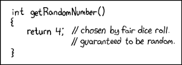
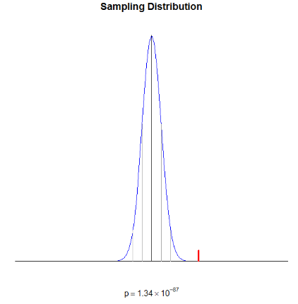

```{r setup, include=FALSE}
knitr::opts_chunk$set(echo = FALSE)
```

## How would you summarize a set of data?

- List the values, find a min/max, range, find the average
- Refer to a known distribution

**Distribution (put loosely)**:

A mathematical rule that describes the relative frequency of different events (e.g., normal, uniform, Bernoulli, binomial, Poisson, etc.)

- For example, a normal distribution:

$$f(x) = \frac{1}{\sqrt{2\pi\sigma^2}}\text{exp}\left[-\frac{1}{2}\frac{(x-\mu)^2}{\sigma^2}\right]$$

## For example

$$f(x) = \frac{1}{\sqrt{2\pi\sigma^2}}\text{exp}\left[-\frac{1}{2}\frac{(x-\mu)^2}{\sigma^2}\right]$$

- We could calculate an average of all values: $\bar{x} = \frac{\sum_{i=1}^n x_i}{N}$

- We could calculate a sample variance of the values: $s^2 = \frac{\sum_{i=1}^N(x_i - \bar{x})^2}{(N-1)}$


## How should we think about $\mu$ and $\bar{x}$?

- What is a variable?
- Recall from past math courses: 7 + x = 10

**Variable vs. unknown constant (loosely):**

- A variable is a number you can move around, not just a number whose value you don't know. 

## Random variable

- What is a random variable?

**Random variables vs. realized values (loosely):**

A random variable is a number that moves around according to a probability distribution. A realized value is just a number, although it may have come from a probabilistic process. 



## Distributions can refer to different sets of entities

- Sample (e.g. the people in your study)
- Population (e.g. all of humanity)

**The Big Question**

- Why is it possible to use what we've discovered about a sample distribution to say something about the population distribution? (And how would we go about this?)


## Samp*ling* distributions

Sample statistics are random variables. 

- E.g., "the" sample mean is a random variable,

- but *your* sample mean is a realized value drawn from that random variable. 

The behavior of random variables can be described by a distribution

Distributions of sample statistics are called **sampling distributions**. 

- If only we knew something about the nature of the sampling distribution. 

## Some (very light) Theory

**The (strong) Law of Large numbers (loosely)**:

- As $N$ goes to infinity, the sample mean converges to the population mean (or true value). 

**The Central Limit Theorem (loosely)**:
If our data are an unbiased sample, where each datum is independent and drawn from the same population, which has mean = $\mu$ and variance = $\sigma^2$, then, as $N$ becomes large, the distribution of the sample mean will be: 

1. Approximately Normal
2. centered on the population mean / true value
3. with variance: $\sigma_{\bar{x}}^2 = \frac{\sigma^2}{N}$ (and thus SE: $\sigma_{\bar{x}} = \frac{\sigma}{\sqrt{N}})$

## Examples

- [Interactive example of Law of Large Numbers](https://www.stapplet.com/largenum.html)


- [Interactive example of Central Limit Theorem](https://stats-interactives.ctl.columbia.edu/central-limit-theorem)

## Why would anyone take samples identically from the same population over and over again?

ANOVA!

- The null hypothesis in a one-way ANOVA is that you sampled the same population repeatedly (i.e. the conditions don't differ)

- ANOVA uses the F-test to determine whether the variability between group means is larger than the variability of the observations within the groups.


## Repeated samples from the same population are useful!

- E.g. if we had a sample of data, and for a given population, knew: 

  1. its mean,
  2. its SD, and
  3. that it was normally distributed,
  
then we could see how our sample compared to that population. We could do so by comparing our sample's mean to the distribution of sample means that would be drawn from that population under repeated sampling. 

$z_{\bar{x}} = \frac{\bar{x}-\mu}{\sigma_{\bar{x}}}$ or $z_{\bar{x}} = \frac{\bar{x}-\mu}{\frac{\sigma}{\sqrt{N}}}$

## IQ example

Say we had the following IQ scores from students in a STATS 102 class: 

$IQ = \{118, 121, 101, 120, 113, 131, 126, 112, \\ 116, 117, 124, 115, 120, 115, 120, 128\}$

We know that the distribution of IQ scores:

1. has a known mean (100)
2. has a known SD (15)
3. is normally distributed


## IQ example (continued)

$IQ = \{118, 121, 101, 120, 113, 131, 126, 112, \\ 116, 117, 124, 115, 120, 115, 120, 128\}$

- Number of observations in sample: $N = 16$

- Sample mean: $\bar{x} = 118.6$

- Sample standard deviation $s_x = 7.1$

- $z_{\bar{x}} = \frac{\bar{x}-\mu}{\frac{\sigma}{\sqrt{N}}}$

- $19.84 = \frac{118.6-100}{15/4}$

## IQ example (continued)


## IQ example (continued)

- 19.84!! That's pretty extreme. 

- In fact, we can ask the question: 
    - What's the probability of gathering a sample with a mean that far or further from the population mean?
    
- The answer to that question is the p-value. 

## P-value visualization



## Two ways to use a p-value

- Fisher: a measure of the amount of evidence against the null hypothesis; lower p-values mean more evidence. 

- Neyman-Pearson: you can either reject or fail to reject the null hypothesis, which in turn could be true or not. There are 4 possible outcomes. 


## 2 types of errors

- **Type 1 error** is rejecting the null hypothesis when it's actually true. 


## Type 2 error and power

- **Type 2 error** is failing to reject the null hypothesis when it's actually false. 

- **Power** is the probability of rejecting the null hypothesis when, in fact, it is false. 

## The logic of hypothesis testing

There is an assymetry in the logic of hypothesis testing: 

- Rejecting the null hypothesis conveys information.

- Failing to reject the null conveys *ambiguity*.

- A non-significant p-value does NOT allow you to accept the null. 

- In other words, we cannot say: "There was no effect."

- Instead, we say: "There was insufficient evidence to reject the null hypothesis.

## What if you don't know the population SD?

- This is where the t-distribution comes in.

- Previously, we calculated our z-statistic because we knew $\sigma$. 

$z_{\bar{x}} = \frac{\bar{x}-\mu}{\frac{\sigma}{\sqrt{N}}}$

- If we don't know $\sigma$, we can substitute it with the sample standard deviation, $s$:

$t_{\bar{x}} = \frac{\bar{x}-\mu}{\frac{s}{\sqrt{N}}}$

- So, you use the sample SD as an estimate of the population SD, and compare the resulting test statistic to the $t$ distribution instead of the normal Z distribution. 

## The $t$ distribution

- The $t$ distribution has only 1 parameter, its degrees of freedom (df). 

- For a one-sample t-test, the df is $N-1$. 

- Note that when the degrees of freedom becomes large ($>30, >50, >100)$, the t-distribution becomes virtually indistinguishable from the normal. 

$f(t) = \frac{\Gamma(\frac{df + 1}{2})}{\sqrt{(df) \cdot \pi} \Gamma\left(\frac{df}{2}\right)}\left(1 + \frac{t^2}{df}\right)^{-(df + 1)/2}$

## What if we have 2 conditions?

- We can make a single statistic by subtracting the two means and comparing the difference to the sampling distribution of the difference between the means. 

$t = \frac{(\bar{x}_2-\bar{x}_1) - (\mu_2 - \mu_1)}{s_{x_1 x_2}\sqrt{\frac{1}{n_1}+ \frac{1}{n_2}}}$

$s_{x_1 x_2} = \sqrt{\frac{(n_1 - 1)s^2_{x_1} + (n_2 - 1)s^2_{x_2}}{n_1 + n_2 - 2}}$

 where $n_1$ and $n_2$ are the sizes of each sample, respectively. 
 

## Parameter Estimation

We can also go in the other direction. That is, what population did our data come from?

- When drawing a sample from a given population, the most likely sample mean to get is the population mean. 

- So, the sample mean is the "best guess" (point estimate) for the population mean. 

- You can use the samp*ling* distribution to get a 95% confidence interval of the population mean. 

## Confidence Intervals

$CI_{95\%} = (\bar{x}-1.96\sigma_{\bar{x}}, \bar{x}+1.96\sigma_{\bar{x}})$

or

$CI_{95\%} = (\bar{x}-1.96 \frac{\sigma}{\sqrt{N}}), \bar{x}-1.96 \frac{\sigma}{\sqrt{N}}))$

## Warning

- Confidence does not mean probability!

- The confidence interval is the range of values that you expect your estimate to fall between a certain percentage of the time if you run your experiment infinitely many times or re-sample the population in the same way.

## Summary

1. Sample statistics are random variables. 

2. The behavior of a statistic is described by its samp*ling* distribution.

3. Under certain conditions (often reasonable), we can make assumptions about the properties of the samp*ling* distribution. 

4. The statistic calculated from your sample is a realized value. 

5. We can use knowledge of the sampling distribution to compare our sample/sample statistic to the population. It is thus possible to assess how improbable our sample (say, sample mean) is and make a decision. 

6. Hypothesis testing is asymmetrically informative. 

7. We can use our sample statistics as estimates of the parameters of the population it came from. 

## Next time

- Topic: What is regression?

- Read: 
  - Neter Chapter 1 (to prepare)
  - Kleinbaum 5.1-5.6


