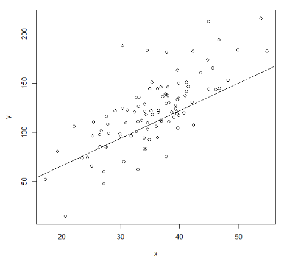
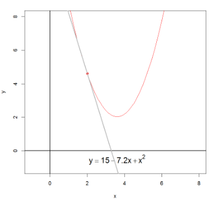

```{r setup, include=FALSE}
knitr::opts_chunk$set(echo = FALSE)
```

## What is regression?

Suppose we have a scatterplot of two variables, $x$ and $y$. 


## What is regression?

Now suppose we fit a line to these data. 




What makes one line better than another?

## How far is a point from the line?


If we want to measure the distance away from each line, we can take the y and x distance from each line. 

## The linear regression model

- The simple linear regression model is:

$$Y = \beta_0 + \beta_1 X + \varepsilon$$

where $\varepsilon \sim N(0, \sigma^2_\varepsilon)$. 

- The equation of a fitted line:

$$\hat{y}_i = \hat{\beta}_0 + \hat{\beta}_1 x_i$$

- The Sum of Squared Errors (SSE) is a loss function that defines how poorly our line fits:

$SSE = \sum_{i=1}^N(y_i - \hat{y_i})^2$

$SSE = \sum_{i=1}^N(y_i - (\hat{\beta}_0 + \hat{\beta}_1 x_i))^2$

- This is called Ordinary Least Squares, or OLS for short. 

## Detour: Calculus

- Recall from calculus learning about finding the derivative. 
- You may have started by calculating the slope of a straight line using the slope formula. 
- But what about the slope of a curved line at any given point?


## Detour: Calculus

<div class="columns-2">

- In order to find the slope of a line at any given point, we need the derivative.

- Recall: If $y = cx^p$, then $\frac{dy}{dx} = cpx^{(p-1)}$
  
$y = 15-7.2x + x^2$
$y = 15x^0 - 7.2x^1 + 1x^2$



</div>

$\frac{dy}{dx}= 15\cdot 0 \cdot x^{(0-1)} \\ - 7.2 \cdot 1 \cdot x^{(1-1)} + 1 \cdot 2 \cdot x^{(2-1)} = -7.2+2x$

$\frac{dy}{dx}= -7.2 + 2x$


So, to find the slope of the line at any given point, you would plug in a given $x$ value to $-7.2+2x$. 

## How about finding the minimum?

If we wanted to find the $x$ value for which this parabola reaches its minimum, we would set the derivative equal to 0 and solve for $x$. 

Again, recall: If $y = cx^p$, then $\frac{dy}{dx} = cpx^{(p-1)}$

$\frac{dy}{dx}= -7.2 + 2x$

$0= -7.2 + 2x$

$3.6 = x$

  
- So, the line $y = 15-7.2x + x^2$ reaches its minimum at $x=3.6$. 

## Solution for $\beta_1$ for the OLS estimator

- In order to find the slope ($\hat{\beta}_1$), we will apply the same concept, except our function is the loss function (SSE). 

- Recall our Loss function: $SSE = \sum_{i=1}^N(y_i - (\hat{\beta}_0 + \hat{\beta}_1 x_i))^2$

- Then the slope of this line is: $\hat{\beta_1} = \frac{\sum_{i=1}^N (x_i - \bar{x})(y_i - \bar{y})}{\sum_{i=1}^N (x_i - \bar{x})^2}$

- This is equivalent to averaging the slopes of the lines from each point to the mean, weighted by how far the point in question is from the mean in the $X$-dimension. (See figure on next slide)

- (Recall the formula for slope: $m = \frac{y_2 - y_1}{x_2 - x_1}$). 


## Visualization of OLS


## Alternative formulas for slope

Slope: $\hat{\beta_1} = \frac{\sum_{i=1}^N (x_i - \bar{x})(y_i - \bar{y})}{\sum_{i=1}^N (x_i - \bar{x})^2}$

Intuitive version: $\hat{\beta_1} = \frac{\text{Cov (X, Y)}}{\text{Var}(X)}$

- The covariance between $X$ and $Y$, or $\text{Cov}(X, Y)$ indicates how the values of $X$ and $Y$ more relative to each other. 

Computational version: $\hat{\beta_1} = \frac{\sum_{i=1}^Nx_iy_i - \frac{(\sum_{i=1}^N x_i)(\sum_{i=1}^N y_i)}{N}}{\sum_{i=1}^Nx_i^2 - \frac{(\sum_{i=1}^N x_i)^2}{N}}$

- The computational version is the original Slope version, but with the terms multiplied. 

## Solution for $\hat{\beta_0}$ for the OLS estimator

So, we calculated the estimated slope for OLS. Now, how about the estimated intercept, $\hat{\beta_0}$?

- Again, consider our loss function: $SSE = \sum_{i=1}^N(y_i - (\hat{\beta}_0 + \hat{\beta}_1 x_i))^2$

- The estimate of the intercept is: $\hat{\beta_0} = \bar{y} - \hat{\beta}_1 \bar{x}$

- The intercept is the expected value of $Y$ when all $X=0$. 


## Note

- Note that regression $Y$ on $X$ is not the same as regressiong $X$ on $Y$. For example:


## Pearson's correlation

- Recall our intuitive formula: $\hat{\beta}_1 = \frac{\text{Cov (X, Y)}}{\text{Var}(X)}$. 

- Pearson's correlation: $r = \frac{\text{Cov}(X, Y)}{\text{SD}(X) \text{SX}(Y)}$

- Pearson's correlation is a number between -1 and 1 that measures the strength and direction of the linear relationship between 2 variables. 


## So, what's the difference between correlation and regression?

- The key difference between correlation and regression is that correlation measures the degree of a relationship between two independent variables (say, $X$ and $Y$).
- In contrast, regression is how one variable affects another. 

- Use correlation to summarize the strength and degree of the relationship between two or more numeric variables. 

- Use regression when you're looking to predict or explain a response between the variables (e.g. how $X$ influences $Y$)

## Summary

1. Regression is about specifying a relationship between regressors (X-variables) and a response (Y-variable). 

2. We assume our X-variable is **fixed** and **known**, and that all of the uncertainty about the relationship between $X$ and $Y$ is *sampling error* in Y. 

3. Assumptions about what it means for one model to fit a dataset better than another are formally encoded in a Loss function (i.e. SSE). 

4. For linear models (i.e. regression), the default loss function is Ordinary Least Squares, although other possibilities exist. 

5. Regression parameter estimates are those values that minimize the loss function; in our case, that *minimize the squared vertical distances between the line and the data. 

## Next up

- Homework will be assigned. 
- Topic: Simple Regression - Inference
- Read: 
  - Neter Chapter 2 (to prepare)
  - Kleinbaum 5.7-5.11

## Comprehension questions for self-study

- Is the fitted OLS regression line the line that is closest to all the data? In what sense?

- How would you choose whether to use Pearson's correlation or regression for two variables? If you choose the latter, how would you choose which variable to be Y? 

- Submit your suggestions!
